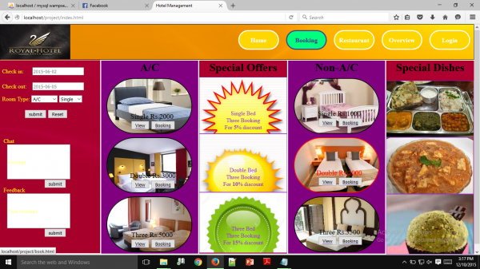
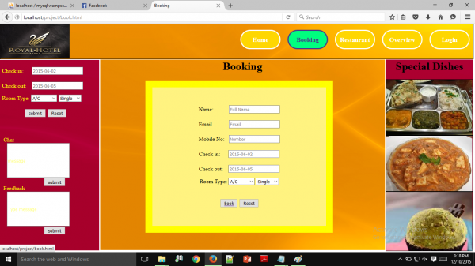
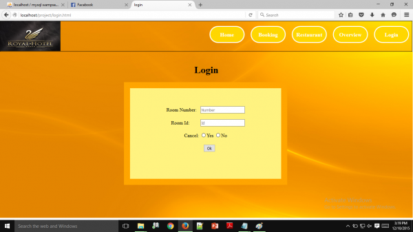
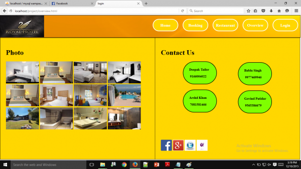
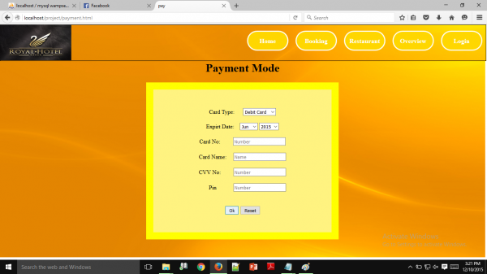
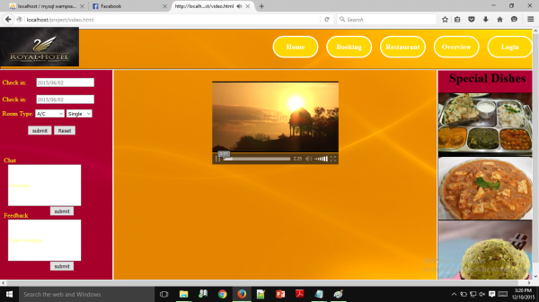

# ✨Online-Restaurant-Management✨
This is a web based application developed for a Hotel work management.
**This web based restaurant application has been developed for the accomplishment of Future Ready Talent Internship program launched by Microsoft, Future Skills Prime, Quess, Github and EY.**

Project Link -  https://restorent-management.azurewebsites.net 
                
Git hub  -      https://lalitt08.github.io/Restaurant-Management/

**Features and Functionalities 😃**

Interactive and responsive UI.
Has many graphical and visual innovative effects.
Have an aesthetically pleasing visual design and architecture.
Has collection of many web pages including Home, Booking, login, ovrview, video pages etc.
manager is able to handle a restorent through the website.
Included the feedback Survey form to increase the scope of improvement**

**Screenshots 📸**
### Home page -   

### Booking page -

### Login page -

### Overview page -

### Payment page -

### Video page -

## Tech Stack 💻

- [Azure(Hosting)](https://azure.microsoft.com/en-in/features/azure-portal/)
- HTML
- CSS
- Bootstrap
- php

